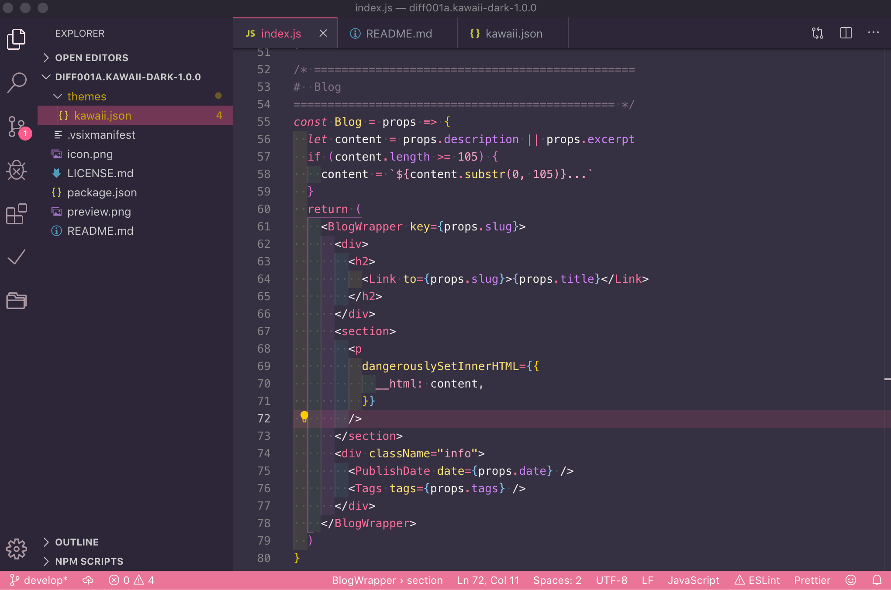

台風で予定が潰れてめっちゃ暇だったので、この暇を利用してVSCodeのテーマを作って、Marketplaceに公開するところまでやってみました。

ピンク率高めのかわいいダークテーマが欲しいなーと思ってたので、そういうイメージで作ってみました。少し紫がかったブラックを背景色にしたことで、甘くなりすぎず、可読性も保てて結構いい感じになったんじゃないかなーと思います✨[今回作成したテーマのMarketplaceページはこちらから確認してみてください！](https://marketplace.visualstudio.com/items?itemName=diff001a.kawaii-theme)

今回の記事では、**Marketplaceに自作の拡張機能を公開する方法**についてまとめておきたいと思います。テーマの開発方法については今回触れていませんのでお気をつけください！

## まずはアカウント作成 & アクセストークンを取得

[Azure DevOps](https://dev.azure.com/)でアカウントを作成してログインします。

ログインしたら画面右上の自分のアイコン部分をクリックして、**Security**を選択すると、**Personal Access Token**ページが表示されるので、**New Token**をクリックして新しいアクセストークンを作成します。

この時に注意するのは、このふたつの項目です。

- **Scopes**は**Full Access**を設定しておく事
- **Organization**は**All accessible organizations**を設定しておく事

このふたつは気をつけておかないと後々エラーが出て苦しめられますので**絶対確認しましょう**！！！

これで`create`ボタンをクリックするとアクセストークンが表示されるのでどこかにメモしておいてください。

このトークンは**後から確認することができないので、**ここでメモしておくのを忘れるともう一回新しいトークンを作成しないといけなくなるので注意です！

## vsceのインストールと設定

Marketplaceに登録するのに`vsce`というツールが必要になるので、インストールと設定を済ませておきます。

### vsceをインストール

```
npm install -g vsce
```

### Publisherの設定

```
vsce create-publisher diff001a
vsce login diff001a
```

ここでさっきメモしたアクセストークンを聞かれるので、入力してください。

**diff001a**の部分は**publisher名**になりますので、好きな名前に変更してください。

## Marketplaceに登録するのに必要なファイルを用意する

Marketplaceに登録するのに必要になるファイルは以下の通りです。

- アイコン画像
- package.json
- README.md
- LICENSE.md

この中でも一番重要なのは、**package.json**です。絶対に必要になるのが以下の部分の記述です。

```json
  "name": "kawaii-theme",
  "displayName": "Kawaii Theme",
  "version": "1.0.0",
  "publisher": "diff001a",
  "description": "A very sweet theme for vscode. enjoy :)",
  "icon": "icon.png",
  "engines": {
    "vscode": "*"
  },
  "galleryBanner": {
    "color": "#353042",
    "theme": "dark"
  }
```

ここで重要なのは**publisher**の部分です！**先ほどvsceの設定で指定した名前(publisher名)**と同じ名前にしておかないと、エラーがでて公開が完了しませんので注意してください！

そのほかにも必須ではありませんが、カテゴリーやタグなどもpackage.jsonから設定できます。

これらのファイルの詳しい内容については[今回作成したテーマのgithubページ](https://github.com/diff001a/KawaiiTheme)を参考にしてみてください！

## ついにMarketplaceに公開 🎉

もうあとは公開するだけです！

package.jsonが置いてあるフォルダに移動して、以下のvsceコマンドを実行しましょう！

```
vsce publish
```

## 雑感

自作テーマは愛着も湧きますし、Marketplaceに公開されると少し達成感も味わえて楽しかったです！いい休日の過ごし方でした✨
