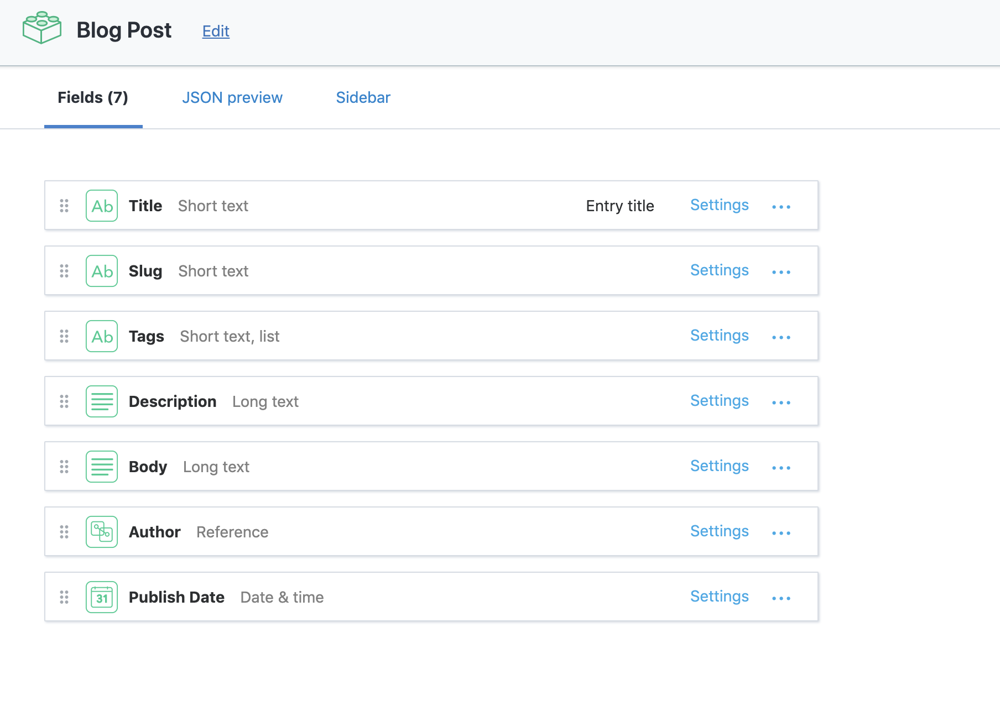

静的サイトジェネレーターと Headless CMS を使ったブログ開発に興味があったので、一番情報が多そうだった Gatsby + Contentful + Netlify の組み合わせで挑戦してみることにしました。

完成品はこのブログです！今回の記事では Gatsby + Contentful で開発を始めるまでの環境構築の部分をまとめておきたいと思います。

## それぞれが担う役割

### Gatsby

React製の静的サイトジェネレーターです。フロントエンド担当 🙋‍♀️

GraphQLを使ってContentfulやWordPressなどの様々なコンテンツソースにアクセスできます。

### Contentful

Headless CMSと呼ばれるもので、バックエンド担当 🙋‍♀️

Headless CMSとはコンテンツの構造とデータ自体の管理を行い、そのデータへのAPIを配信してくれるものです。

バックエンドをHeadless CMSに任せることでフロントエンドとバックエンドを完全に分離する事ができるので、フロント側では自分がいつも使っているフレームワークや環境を用いて開発を行う事が可能になります 🎉

### Netlify

ホスティングするところです 🙋‍♀️

build hooks を追加できるので、NetlifyとContentfulにwebhookを設定し、紐付けすることでContentfulから記事を Publishすると自動で githubのリポジトリにプッシュして、Netlifyへのデプロイを実行する、という設定が簡単に追加できるということなので選びました！

## 制作までの流れ

### Gatsby をインストール

npmでgatsby-cliをインストールします。

```
$ npm install --global gatsby-cli
```

### Gatsbyアプリを作成

create-react-app みたいな感じで、コマンド一つで簡単にプロジェクトの作成ができます。

```
$ gatsby new my-gatsby-blog
```

これで my-gatsby-blog という名前のフォルダが作成されます。

### 開発用サーバーを立ち上げる

```
$ cd my-gatsby-blog
$ gatsby develop
```

これでブラウザから`localhost:8000`にアクセスしてスタートページが表示されていればGatsby側の開発準備は完了です。

### Contentfulでスペースとコンテンツモデルの作成

[https://app.contentful.com/](https://app.contentful.com/)

Contentful のユーザー登録を済ませて管理画面にログインしたら、ブログ用のスペースと、コンテンツモデルを作成します。

割と直感的に操作できるので詳しい説明は省きますが、うちのコンテンツモデルはこんな感じです。

デフォルトの blog 用コンテンツモデルからほとんど変更してないと思います。



### API アクセストークンの取得

Contentful管理画面からSetting→API keys

画面右側のADD API Keysボタンから新しいキーを追加し、space IDとaccess tokenをメモしておきます✍️

### Gatsby アプリとContentfulの紐づけ

データソースに Contentful を使う為のプラグイン[gatsby-source-contentful](https://www.gatsbyjs.org/packages/gatsby-source-contentful/)をインストールしてから、**gatsby-config.js**に以下の記述を追加します

```javascript
module.exports = {
  ...
  plugins: [
    ...
    {
      resolve: `gatsby-source-contentful`,
      options: {
        spaceId: `スペースID`,
        accessToken: `アクセストークン`,
      },
    },
  ],
}

```

これでgatsbyからcontentfulのデータソースへアクセスする準備ができました 🎉

## Contentfulで記事をPublishしたら、Netlifyのデプロイを実行する設定

こちらの方法に関しては[こちらのブログ](https://hyme.site/blog/posts/effective-public-flow/)に詳しく手順が書いてあったので、参考にさせていただきました！

## おわり〜🎉

まだ最低限の機能しかないのでこれからぼちぼちいろんな機能を追加していけたらなとおもいます✨

## 追記

[Contentful辞めました:joy:](/gatsby-blog-with-markdown/)