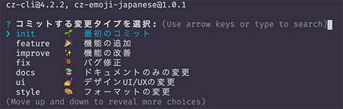

ちゃんとしたコミットメッセージを書きたいなと思い**Commitizen**を導入してみたんですが、プレフィックスを絵文字にできたらもっといいのになーと思いやり方をいろいろ調べてみたのでまとめておきます！

## まずCommitizenとは？

Commitizenは対話型でコミットメッセージを作成できるツールです。

- コミットのタイプ(prefix)
- コミットのスコープ
- コミットのタイトル
- コミットの本文
- 破壊的変更の有無
- 関連issueの有無

上記の質問に順番に答えていくだけで、適切なコミットメッセージを作成することができます。

Commitizenで作成されたコミットメッセージはこんな形式になります。

```bash
type(scope): タイトル

本文
```

## cz-emoji(cz-emoji-japanese)とは？

githubとかで見かけるプレフィックスに絵文字を使っているコミットメッセージって可愛いし、どんな変更を加えたのかが直感的にわかるのがいいですよね。

Commitizenだと`cz-emoji`というツールを導入することで絵文字プレフィックスに対応できるんですが、コミットタイプの種類があまりにも多すぎるのでカスタマイズして使用することが前提とされているように感じました。

そこでよく使いそうなタイプに絞り、質問文やタイプの説明などを日本語に翻訳して使いやすくしたものを`cz-emoji-japanese`という名前のnpmパッケージとして公開してみました🎉

[githubレポジトリはこちらです！](https://github.com/diff001a/cz-emoji-japanese)

## インストール方法

```bash
yarn global add commitizen # commitizenインストール
yarn global add cz-emoji-japanese # cz-emoji-japaneseインストール
echo '{ "path": "cz-emoji-japanese" }' > ~/.czrc 
```

後はコミットを行いたいリポジトリ内で、`git commit`とする代わりに以下のコマンドを実行してください！

```bash
git cz
```

順番に質問が表示されていくので、コミットメッセージを作成していきましょう✨

## おわり🎉

タイプの種類や対応する絵文字などは[gitmoji](https://gitmoji.carloscuesta.me/)などを参考にしながら考えてみたんですが、まだまだ改善の余地があると思うのでもっといいアイディアがある方は是非issueなどお寄せください😊

